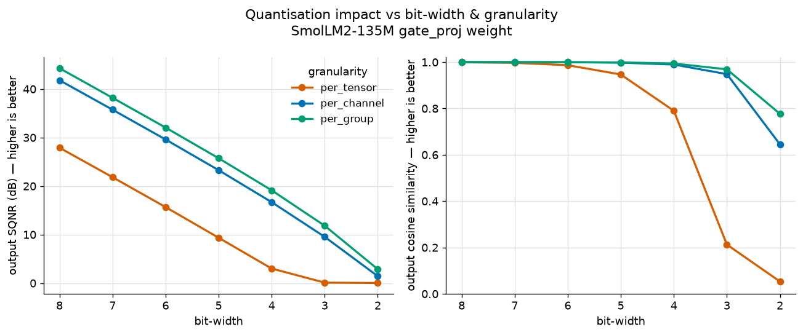
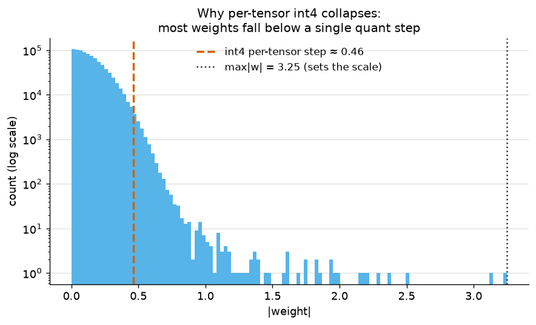

# T1 — Number representation / floating point / quantization foundation

**Artefact (a01):** a symmetric integer quantizer built from scratch, used to measure **quantization
error vs. bit-width and granularity** on a real LLM weight tensor — reproducing, from first
principles, the **activation-outlier problem** that forces per-channel/per-group quantization.

**Status:** complete.

---

## Lab note

**Question:** How does quantization error scale with bit-width (8 → 2) and granularity (per-tensor
vs per-channel vs per-group), and where do weight outliers break it?

**Setup:**
- **Tensor:** `model.layers.0.mlp.gate_proj.weight` from `HuggingFaceTB/SmolLM2-135M`, shape
  `(1536, 576)`, loaded straight from safetensors as float32. `max|w| = 3.25` vs `mean|w| = 0.15` —
  a ~22× outlier, which turns out to be the whole story.
- **Method:** symmetric integer quantization (round-to-nearest) with absmax calibration — the
  simplest textbook baseline, chosen deliberately to expose *where the naive method fails*.
- **Sweep:** bit-widths `{8,7,6,5,4,3,2}` × granularities `{per-tensor, per-channel, per-group
  (group_size=64)}`.
- **Metrics:** weight SQNR (dB); and **output fidelity** — SQNR, relative L2 error, and cosine of
  the layer output `W @ x` vs `Ŵ @ x` on a fixed random Gaussian input `x` (512 columns, seed 0).
  Output fidelity is what inference actually experiences; weight error is only a proxy.
- **Hardware:** CPU only — this measures a numerical *property* of the weights, not inference speed,
  so no GPU is needed.
- **Reproduce:** `uv run python topics/t01_number_representation/probe.py` (table) and
  `uv run python topics/t01_number_representation/plot.py` (figures).

**Result:**

| n_bits | granularity | out SQNR (dB) | out error % | out cosine |
|---|---|---|---|---|
| 8 | per-tensor | 27.9 | 4.0 | 0.9992 |
| 8 | per-group | 44.3 | 0.6 | 1.0000 |
| 4 | per-tensor | **3.0** | **70.9** | **0.790** |
| 4 | per-channel | 16.7 | 14.7 | 0.9894 |
| 4 | per-group | 19.1 | 11.1 | 0.9939 |
| 3 | per-tensor | 0.1 | 98.9 | 0.212 |
| 2 | per-tensor | 0.0 | 99.9 | 0.053 |

**Headline finding:** *Granularity barely matters at int8 but is the difference between broken and
usable at int4.* Naive per-tensor int4 produces **71% output error (cosine 0.79 — direction
destroyed)**; simply switching to per-group recovers it to **11% error (cosine 0.99)**. On the
quality-vs-bits curve, per-group at 3 bits matches per-tensor at ~5.5 bits — **granularity is worth
~2–3 bits.** Two secondary findings: (1) weight SQNR tracks output SQNR almost exactly, so weight
error is a faithful (and cheap) proxy here; (2) worst-case (max-abs) error is nearly constant across
granularities — it would have *hidden* the collapse, which is why SQNR/cosine (bulk metrics) are the
ones that matter.

**Inference payoff:** This is precisely why production int4 quantization uses per-group scales, and
the motivation behind **GPTQ / AWQ / SmoothQuant**. The `weight_outliers.png` histogram shows it
directly: a single outlier at 3.25 sets the per-tensor scale, making the int4 step ≈ 0.46 — and the
*entire bulk* of weights (mean 0.15) sits below one step, so they round to 0/±1 and vanish.
Per-channel/group quarantine the outlier to its own channel/group, so every other channel keeps a
fine scale. I reproduced the motivation for the entire modern weight-quantization literature from a
~40-line baseline.

**What surprised me:** _(DRAFT — Oscar to rewrite in his own words.)_ I expected int4 to be "a bit
worse," not a **71% / cosine-0.79 collapse** — the naive baseline doesn't gently degrade, it falls
off a cliff. And I was surprised how completely one outlier value drives it: the histogram makes the
"skyscraper and an ant on one ruler" intuition concrete.

**Caveats:**
- **Baseline method, not SOTA:** round-to-nearest + absmax. GPTQ/AWQ do meaningfully better at low
  bits; the point here was to show the baseline's cliff, not to compete.
- **Random-input proxy:** output fidelity uses a random Gaussian `x`. Real activations have their own
  distribution and outliers, so real-world output error could differ.
- **One tensor, one small model:** this is a layer-level fidelity study, not a full-model
  perplexity/accuracy result.
- **Quality only:** memory and latency (the *payoff* of quantization) aren't measured here — that's
  deliberately deferred to the roofline (T7) and serving artefacts.
