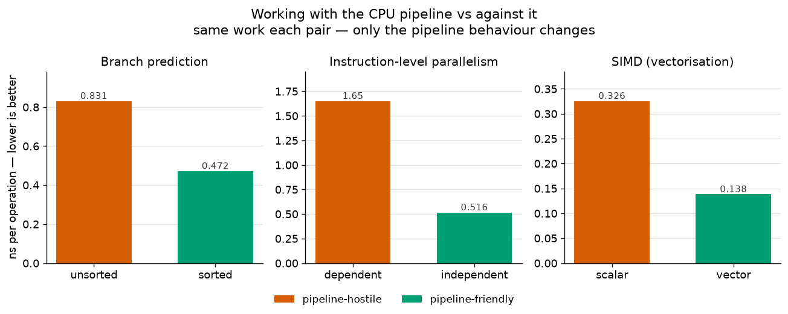
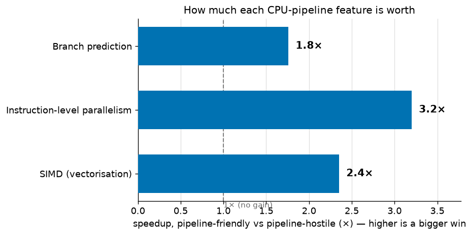

# T2 — CPU execution and the pipeline

**Artefact (a02):** a from-scratch C microbenchmark that isolates and measures three things a modern
CPU does to go fast — **branch prediction**, **instruction-level parallelism (ILP)**, and **SIMD** —
by running *identical work* two ways and changing only how well it fits the pipeline. Each result ties
back to why latency-bound, one-token-at-a-time inference is slow on hardware built for throughput.

**Status:** complete.

---

## Lab note

**Question.** A CPU pipelines, predicts, reorders, and vectorises to run fast. What does each of those
features actually *buy* — in nanoseconds — and what happens to code that fights them? And why does
that shape the CPU-vs-GPU inference story?

**Setup.** Three experiments, each a *matched pair*: same arithmetic, same data, only the pipeline
behaviour changes.
- **(a) Branch prediction:** an array of random ints (0–255); a loop summing only the elements ≥ 128.
  Time it on a **sorted** vs **shuffled** copy of the same data — the sum is identical, but the branch
  is perfectly predictable when sorted and a ~50/50 coin-flip when shuffled.
- **(b) ILP / latency vs throughput:** the same 100M multiply-adds arranged as one **serial dependent
  chain** (`acc = acc*a + b`, each step waits on the last) vs **8 independent chains** the CPU can
  overlap.
- **(c) SIMD:** the same element-wise `out[i] = x[i]*k + y[i]` compiled **scalar** (one element per
  instruction) vs **auto-vectorised** (several per instruction).
- **Method:** `-O2`, portable `clock_gettime`; median of 15 trials. Defeating the optimiser was the
  hard part (see *What surprised me*): a `volatile` sink + a zero-instruction `asm` barrier stop it
  precomputing the loops, and a barrier *inside the branch* stops it converting the branch into a
  branchless `cmov` — which would erase experiment (a) entirely.
- **Hardware:** **AMD EPYC-Milan, x86_64** (Hetzner CCX13, 2 dedicated vCPU, Ubuntu). Authored and
  debugged on an Apple-Silicon Mac, but ARM mutes the branch effect and lacks `rdtsc`, so the
  canonical numbers come from x86 — the divergence is itself a finding.
- **Reproduce:** `make run` (writes `results/pipeline.csv`), then `uv run python plot.py`.

**Result.**

| Experiment | pipeline-hostile | pipeline-friendly | unit | speedup |
|---|---|---|---|---|
| Branch prediction | unsorted **0.831** | sorted **0.472** | ns/elem | **1.76×** |
| Instruction-level parallelism | dependent **1.651** | independent **0.516** | ns/op | **3.20×** |
| SIMD | scalar **0.326** | vector **0.138** | ns/elem | **2.35×** |



*Each pair does identical work; only the pipeline behaviour differs. Note the independent y-axes — the
three effects live at very different magnitudes, so a shared axis would misrepresent them.*



*The same three results as a single headline: how many times faster the pipeline-friendly variant is.
ILP is the biggest lever here (3.2×), branch prediction the smallest (1.8×) — but all three are real,
and all three come for free from *arranging the same work* to suit the hardware.*

**Headline finding.** *On identical arithmetic, how you present the work to the pipeline is worth
1.8×–3.2×.* A predictable branch is **1.76×** faster than a coin-flip one; breaking a serial
dependency into 8 independent chains is **3.20×** faster; letting the compiler vectorise is **2.35×**
faster. The ILP result is the sharpest: a single dependent chain leaves most of the core idle waiting
on ~5-cycle multiply-add latency, and simply having 8 *independent* multiply-adds in flight reclaims
most of that — same instructions, 3× the speed.

**Inference payoff.** This is the CPU-vs-GPU inference story from the metal up:
- **ILP → why decode is slow, and why batching exists.** Autoregressive decode is a *serial dependent
  chain*: token *N+1* needs token *N*. That's experiment (b)'s slow case — latency-bound, and no amount
  of raw throughput hardware can parallelise a dependency away. It's precisely why per-token decode
  underuses a GPU, and why **continuous batching** works: independent request streams are the
  "independent chains" that refill the idle throughput (the 3.2× on the *other* axis).
- **Branch → why sampling loops are a poor fit for wide hardware.** Top-k/top-p sampling, stopping
  criteria, beam bookkeeping are *unpredictable, branchy* control flow — experiment (a)'s slow case.
  CPUs pay a misprediction penalty; GPUs, which hate divergent branches even more, pay via warp
  divergence. Either way, branchy token logic doesn't map onto throughput hardware.
- **SIMD → the "wide" that makes matmul fast.** Experiment (c) is a CPU-scale glimpse (AVX, ~2–8 lanes)
  of the same idea GPUs take to the extreme (SIMT, thousands of lanes). It's why the matrix multiplies
  at the heart of inference are throughput-bound and love low precision — narrower types pack more
  lanes per instruction.

The through-line: **CPUs are latency-optimised, GPUs throughput-optimised.** These three microbenchmarks
are the CPU-side levers of exactly that trade-off — and decode is slow because it lands on the wrong
side of all three.

**What surprised me.** Three things:
- **The measurement is only as honest as your fight with the optimiser.** My first two x86 runs gave
  *nonsense* — branch and ILP both reported ~0 ns, and the branch speedup was a flat 1.00×. The
  compiler had (1) precomputed the pure loops once and reused the answer, and (2) converted the branch
  into a branchless `cmov`, deleting the very thing I was measuring. The real work of a microbenchmark
  isn't the loop — it's *stopping the compiler from outsmarting you*. I now understand `volatile`
  sinks and `asm` memory barriers as tools, not incantations.
- **A dependency is more expensive than the arithmetic.** I expected independent chains to be *a bit*
  faster; 3.2× on identical multiply-adds drove home that a modern core is mostly *waiting*, and the
  win is in giving it independent work to hide the wait. That reframed autoregressive decode for me:
  the bottleneck isn't the FLOPs, it's the serialisation.
- **The same code has a different truth on different silicon.** The branch effect was muted on Apple
  Silicon (1.2×) and clear on x86 (1.76×) — same source, different microarchitecture and compiler
  choices. It's a concrete reminder that "measure on the target hardware" isn't pedantry.

**Caveats.**
- **Absolute ratios are conservative, especially the branch.** The barrier I inserted to *keep* a real
  branch also weights the loop body, compressing the sorted-vs-unsorted ratio; a barer loop can show a
  larger branch effect. The *direction and mechanism* are what matter here, not the exact multiple.
- **ILP blends into SIMD.** The independent-chains version is partly auto-vectorised, so its speedup is
  ILP *and* some SIMD throughput — honest for "throughput vs latency", but not a pure ILP isolation.
- **Platform-dependent data.** `rand()` differs between glibc and macOS, so the arrays aren't identical
  across machines (checksums match *within* a platform, confirming sorted == unsorted). A portable PRNG
  would fix this; it doesn't affect the conclusions.
- **Microbenchmarks, not inference.** These measure pipeline *properties* on a single dedicated vCPU —
  the inference payoff is the argued through-line, not an end-to-end serving measurement (that's T7 and
  the serving artefacts).

---

### CSV contract

`bench.c` writes `results/pipeline.csv`; `plot.py` reads it. Columns:

```
experiment,variant,n,ns_per_elem,checksum
branch,unsorted,...
branch,sorted,...
ilp,dependent,...
ilp,independent,...
simd,scalar,...
simd,vector,...
```

- `experiment` — `branch`, `ilp`, or `simd`
- `variant` — `sorted`/`unsorted` (branch), `dependent`/`independent` (ilp), or `scalar`/`vector` (simd)
- `n` — elements (branch/simd) or multiply-adds (ilp) processed
- `ns_per_elem` — median nanoseconds per unit of work (the headline number)
- `checksum` — the sink value, printed so the compiler can't elide the loop and so runs are verifiable
