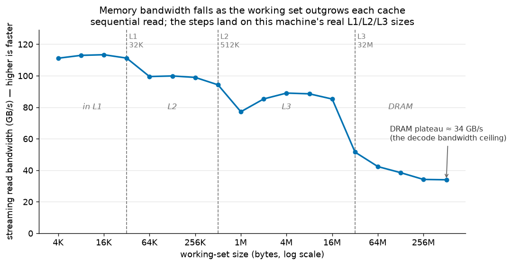
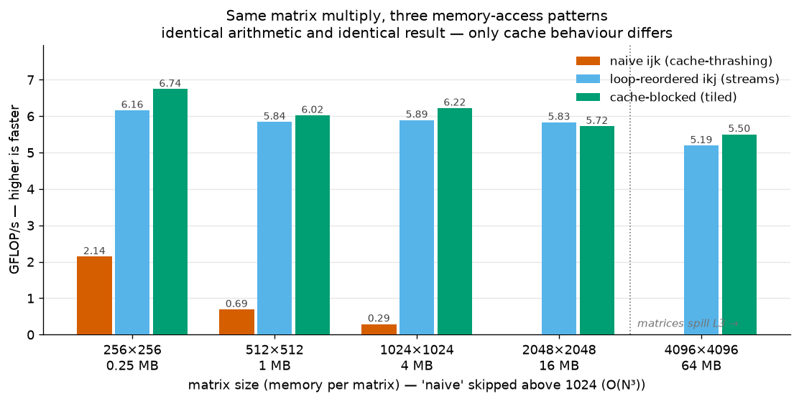
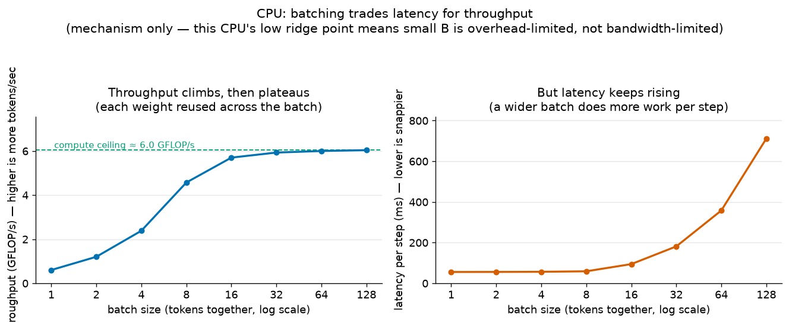
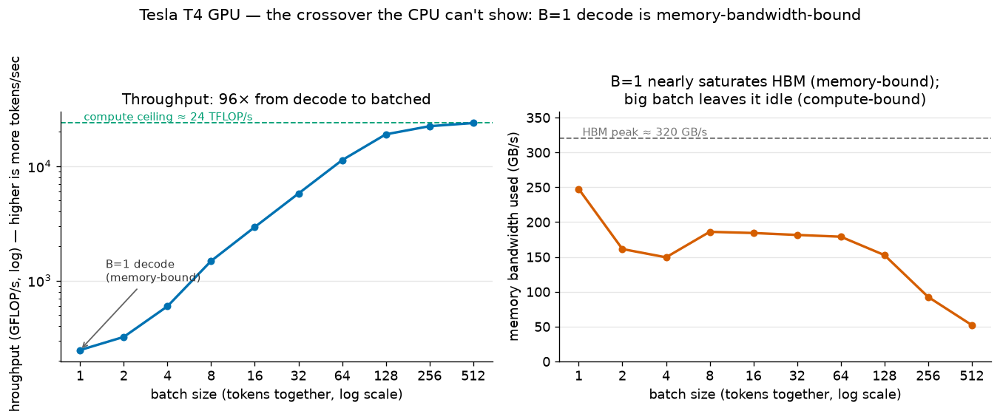

# T3 — Memory hierarchy & the memory-vs-compute wall

**Artefact (a03):** three from-scratch microbenchmarks that measure **why LLM decode is
memory-bandwidth-bound — and what makes it fast**. Written in C and run on a Linux x86 box, with a
small PyTorch companion on a GPU:
1. **Bandwidth hierarchy** — how fast the machine can *stream* data as the working set grows past
   L1 → L2 → L3 → DRAM. This finds the DRAM ceiling that ultimately caps decode speed.
2. **Tiling matmul** — the *same* matrix multiply done three ways (naive → loop-reordered →
   cache-blocked), showing that the **memory-access pattern**, not the arithmetic, sets the speed.
3. **Memory-bound vs compute-bound** — matrix×vector (decode) vs matrix×matrix (batched), swept over
   the batch dimension to find the **crossover**. Measured on a CPU (where it reveals the *mechanism*)
   and on a GPU (where decode is *genuinely* memory-bound — the case that actually matters).

**Status:** complete.

## Reproduce

```bash
cd topics/t03_memory_hierarchy
make run                # builds bench.c → results/memory.csv (+ prints a summary to stderr)
uv run python plot.py   # writes results/*.png
uv run pytest .         # directional integration checks
```

The **canonical CPU numbers and cache-size annotations require Linux x86** — the OS cache-size query
(`sysconf`) is Linux-only, and cache boundaries / bandwidth differ on Apple Silicon. On the Mac you
get a working build to debug, without the cache-size rows.

**GPU companion (Experiment 3 only).** The CPU can't exhibit memory-bound decode (see the lab note),
so the memory-bound half is measured on a GPU. On a free Google Colab **T4 GPU runtime**, paste the
cell in [`gpu_crossover.py`](gpu_crossover.py) (self-contained PyTorch, no repo needed) and save its
printed CSV as `results/crossover_gpu.csv`. `plot.py` picks it up automatically.

---

## Lab note

**Question.** How fast can this machine actually *stream* data as the working set outgrows each cache,
and where does compute stop waiting on memory? And why does that make LLM **decode** memory-bound —
while **prefill** and **batching** are not?

**Setup.** Three experiments in C (`-O2`, portable `clock_gettime`, warmup + median of trials), plus
a PyTorch GPU companion for the third. Each is explained in plain terms first, then precisely.

- **(a) Bandwidth hierarchy.**
  *In plain terms:* we read a block of numbers over and over and time it, growing the block from
  4 KB to 512 MB. Small blocks live in the fast on-chip caches; big ones only fit in slow main memory
  (DRAM). Plotting speed vs block size draws a **staircase** — one step per cache level.
  *Precisely:* sequential read (prefetcher-friendly, the realistic streaming case) into **8
  independent accumulators** so *memory*, not the adder, is the bottleneck (the T2 ILP trick). GB/s
  vs working-set size. The machine's real L1/L2/L3 sizes are emitted so the plot can mark the steps.

- **(b) Tiling matmul.**
  *In plain terms:* multiply two matrices three different ways that all compute the **exact same
  answer** — the only difference is the *order* in which they touch memory. A cache-friendly order is
  dramatically faster than a cache-hostile one, for free.
  *Precisely:* `C = A·B` via **naive `ijk`** (walks B down its columns → cache-thrashing), **loop-
  reordered `ikj`** (streams B along rows → sequential, vectorises), and **cache-blocked** (works in
  tiles kept hot in cache — the Flash-Attention principle). GFLOP/s at sizes 256 → 4096 (the largest
  spills the 32 MB L3). `naive` is O(N³) with a terrible constant, so it's only timed up to 1024.

- **(c) Memory-bound vs compute-bound.**
  *In plain terms:* a big weight matrix times **one** activation vector is **decode** (one token);
  times a **batch** of vectors is **batched decode**. We sweep the batch size and watch two things:
  throughput (work/second) and per-request latency. Batching reuses each weight across the batch, so
  throughput climbs — but latency eventually rises too. Batching isn't free.
  *Precisely:* fixed W (4096×4096) times X (4096×B), using the `ikj` kernel, for B = 1…128. GFLOP/s
  and ms/step vs B. **On a GPU** (Colab T4, fp16, W 8192×8192) the same sweep also records **bandwidth
  used**, which is the piece the CPU cannot show.

- **Hardware.** CPU: **AMD EPYC-Milan, 2 vCPU (1 core / 2 threads), L1d 32 KB · L2 512 KB · L3 32 MB**
  (Hetzner CCX13, Ubuntu) — authored/debugged on an Apple-Silicon Mac, canonical numbers from x86.
  GPU: **NVIDIA Tesla T4** (Google Colab, ~320 GB/s HBM).

**Result.**

### (a) Bandwidth: a clean staircase down to the DRAM wall



| Working set | Tier | GB/s |
|---|---|---|
| ≤ 32 KB | **L1** | ~111 |
| 64 KB – 512 KB | **L2** | ~94–100 |
| 1 – 16 MB | **L3** | ~77–89 |
| ≥ 64 MB | **DRAM** | **~34** |

The steps land **exactly** on the reported cache sizes (32 K / 512 K / 32 M). The upper steps are
gentle and the **L3 → DRAM drop is the cliff** (85 → 34 GB/s, ~2.5×) — which is the correct signature
of a *bandwidth* test: sequential reads let the prefetcher hide cache latency, so every cache tier
streams near its limit and only DRAM throttles. (A *latency* test — random pointer-chasing — would
instead show huge steps.) **That ~34 GB/s DRAM plateau is the real decode ceiling.**

### (b) Tiling: the memory-access pattern is worth ~20×



| N | naive | ikj | blocked |
|---|---|---|---|
| 256 | 2.14 | 6.16 | 6.74 |
| 512 | 0.69 | 5.84 | 6.02 |
| 1024 | **0.29** | **5.89** | 6.22 |
| 2048 | — | 5.83 | 5.72 |
| 4096 | — | 5.19 | 5.50 |

*(GFLOP/s. All three methods produce an identical result — the C checksums match to the digit,
proving the optimisations don't change the maths.)*

`naive` **collapses** as the matrix grows (2.14 → 0.29) because it walks B down its columns and
thrashes the cache harder at every size. Simply **reordering the loops to `ikj` is ~20× faster at
N=1024** (0.29 → 5.89) — same arithmetic, same answer, just sequential memory access. Cache-**blocking**
adds only ~0–9% on top, *even at 4096 (64 MB matrices that spill the 32 MB L3)* — and the reason is the
**same ridge-point idea as Experiment (c)**. This scalar single-thread kernel is **compute-bound** at
~6 GFLOP/s: N=4096's 137 GFLOP take ~23 s of arithmetic, while even re-streaming B from DRAM every
pass is ~7 s, hidden underneath. Memory isn't the bottleneck, so cutting memory traffic — which is *all*
blocking does — saves almost nothing. Blocking wins only once compute is *fast enough* to make memory
the limiter (a vectorised / multi-threaded / GPU kernel — what production BLAS is). **This is also why
Flash-Attention's tiling is transformative and ours isn't:** it runs on a GPU (memory-bound) *and* it
avoids writing the giant S×S attention scores to slow HBM — a far larger memory saving than a plain
`C = A·B` has to offer. **Tiling is a memory-bound-regime optimisation; on a compute-bound kernel it has
nothing to bite on.**

### (c) Crossover: memory-bound → compute-bound

**On the CPU — the mechanism, but not the label.**



Throughput doubles with the batch while small (0.60 → 1.20 → 2.38 → 4.57 GFLOP/s for B = 1→8) then
**plateaus at ~6 GFLOP/s** — and that ceiling *matches Experiment (b)'s* ~6 GFLOP/s (same kernel, same
compute limit — a nice internal check). Per-request latency is flat (~55 ms) until the knee, then
climbs steeply (94 → 181 → 358 → **712 ms**). So batching **trades latency for throughput** — shown
directly. **But** at B=1 this CPU moves only ~1.15 GB/s (3% of its 34 GB/s) and hits ~10% of its
compute peak — it's **overhead-bound**, not memory-bound. It *can't* be memory-bound: this CPU's
**ridge point** (compute ÷ bandwidth ≈ 6 GFLOP/s ÷ 34 GB/s ≈ **0.18 flop/byte**) is *below* GEMV's
intensity (~0.5 flop/byte), so even a perfect kernel here would be compute-bound. Memory-bound decode
is a **high-ridge-point (GPU)** phenomenon.

**On the GPU — decode is genuinely memory-bandwidth-bound.**



On a Tesla T4 (ridge point ≈ 200 flop/byte), the crossover is real and complete:
- **B=1 (decode):** 247 GFLOP/s — but it moves **247 GB/s, ~77% of the T4's 320 GB/s HBM**, while
  using ~1% of the compute. **Memory-bandwidth-bound, confirmed.**
- **Large B (batched):** throughput climbs **96×** to a **~24 TFLOP/s compute-bound plateau**, and
  the bandwidth it uses *falls* (down to 52 GB/s) — the memory system now sits idle while the math
  units are saturated.
- **Batching is nearly free in the memory-bound regime:** latency barely moves from B=1 to B=64
  (0.54 → 0.76 ms) while throughput rises **45×**. That is *exactly* why decode gets batched.

**Headline finding.** *Two of the three results didn't match the naïve story — and that's the point.*
(1) On identical arithmetic, **how you traverse memory is worth ~20×** (naive→ikj); cache-blocking on
one thread is a further ~0–9%, not the big lever people expect. (2) The **memory-bound → compute-bound
crossover is governed by the device's ridge point**: on this CPU (ridge ≈ 0.18 flop/byte) even
single-vector GEMV is compute/overhead-bound, so decode looks "fine"; on a GPU (ridge ≈ 200) B=1
decode saturates HBM at ~77% and is unambiguously memory-bound. **That is why decode being
memory-bound is specifically a GPU story** — GPUs have enormous compute relative to bandwidth.

**Inference payoff.** This is the mechanical basis for how LLMs are served.
- **Decode is memory-bandwidth-bound, so its speed ceiling is `bandwidth ÷ weight-bytes`.** Decode
  reads *every* weight once to produce *one* token, so tokens/sec ≤ memory-bandwidth ÷ model-weight-
  bytes. On the T4's 320 GB/s, a 7B fp16 model (14 GB) caps single-stream decode at ≈ **23 tok/s**;
  on an H100 (3.35 TB/s HBM) the same model → ≈ **240 tok/s**. Nothing about faster *compute* moves
  that number — only bandwidth (or fewer weight-bytes, i.e. **quantisation**, T1) does.
- **Batching escapes it by raising arithmetic intensity.** Stacking B tokens reuses each weight-read
  B times, so throughput climbs to the compute-bound plateau (the GPU's 96×). In the memory-bound
  regime this is *nearly free on latency* — which is why **continuous batching** (vLLM) is the single
  biggest serving-throughput lever.
- **Prefill is compute-bound** for the same reason batched decode is: a long prompt is already a
  matrix (many tokens at once), so its arithmetic intensity is high.
- This directly sets up the **roofline** (T7): ridge point, arithmetic intensity, and the two ceilings
  measured here (34 GB/s bandwidth, ~6 GFLOP/s CPU compute; 320 GB/s, ~24 TFLOP/s GPU) are its axes.

**What surprised me.** Three things:
- **The naïve "ladder" was really one big step and one tiny one.** I expected naive → ikj → blocked to
  climb evenly. Instead reordering the loops did ~20× and cache-blocking did almost nothing — because
  this scalar kernel is *compute-bound*, so cutting memory traffic saves nothing (the same ridge-point
  logic as Experiment 3). It reframed tiling for me: it's not a magic button, it's a *memory-bound-
  regime* optimisation — which is exactly the condition Flash-Attention runs under (a GPU, plus a giant
  S×S intermediate it keeps out of slow HBM) and my compute-bound CPU kernel does not.
- **My CPU literally could not show the headline effect — and understanding *why* was the real
  result.** Experiment 3's "B=1 is memory-bound" simply isn't true on a CPU: I measured B=1 using 3%
  of bandwidth and 10% of compute. The ridge-point argument (compute ÷ bandwidth) explains it, and
  explains why the effect is a GPU phenomenon. Chasing that discrepancy taught me more than a clean
  result would have.
- **In the memory-bound regime, batching is *free*.** On the GPU, going from 1 to 64 tokens per step
  raised throughput 45× while latency barely moved. Seeing "45× more work in the same wall-clock" made
  continuous batching click in a way the theory hadn't.

**Caveats.**
- **CPU compute peak is scalar-ish and single-thread**, so the ~6 GFLOP/s ceiling and the "blocking
  barely helps" result are properties of *this* kernel/hardware, not of matmul in general. A
  multi-threaded, register-tiled kernel would show blocking's value and a far higher ceiling.
- **Experiment 3 on the CPU measures the batching *mechanism* (weight reuse → higher intensity), not
  bandwidth-bound decode** — the CPU's ridge point forbids the latter. The GPU companion supplies the
  genuine memory-bound case.
- **The GPU run is a single-layer GEMV/GEMM microbenchmark**, not end-to-end serving: it models the
  *weight-streaming* cause of memory-bound decode, not the **KV cache** (which also grows with context
  and adds its own bandwidth pressure — the subject of a later artefact).
- **`bandwidth ÷ weight-bytes` is a ceiling, not a prediction** — real decode also pays for attention,
  the KV cache, and kernel-launch overhead, so achieved tok/s is lower. It's the right *upper bound*,
  and the right intuition.

---

### CSV contract

`bench.c` writes `results/memory.csv`; the GPU cell writes `results/crossover_gpu.csv`; `plot.py`
reads both. One tidy **long format**:

```
experiment,variant,size,metric,value
bandwidth,read,4096,gb_per_s,...          # (a) working-set bytes -> GB/s
tiling,naive,1024,gflop_per_s,...         # (b) matrix N -> GFLOP/s  (naive only up to 1024)
tiling,ikj,4096,gflop_per_s,...
tiling,blocked,4096,gflop_per_s,...
crossover,batched,16,gflop_per_s,...      # (c) batch B -> GFLOP/s (throughput)
crossover,latency,16,ms_per_step,...      # (c) batch B -> ms/step (per-request latency)
cache,L1,32768,size_bytes,32768           # machine cache sizes, for the plot's boundary lines
crossover_gpu,batched,1,gflop_per_s,...   # GPU companion: throughput
crossover_gpu,bandwidth,1,gb_per_s,...    # GPU companion: HBM bandwidth used (the memory-bound proof)
crossover_gpu,latency,1,ms_per_step,...   # GPU companion: latency
```

- `experiment` — `bandwidth`, `tiling`, `crossover`, `cache` (in `memory.csv`); `crossover_gpu` (in `crossover_gpu.csv`)
- `variant` — `read`; `naive`/`ikj`/`blocked`; `batched`/`latency`; `L1`/`L2`/`L3`; (GPU) `batched`/`bandwidth`/`latency`
- `size` — working-set bytes · matrix N · batch size · cache bytes
- `metric` — `gb_per_s`, `gflop_per_s`, `ms_per_step`, or `size_bytes`
- `value` — the measured number
